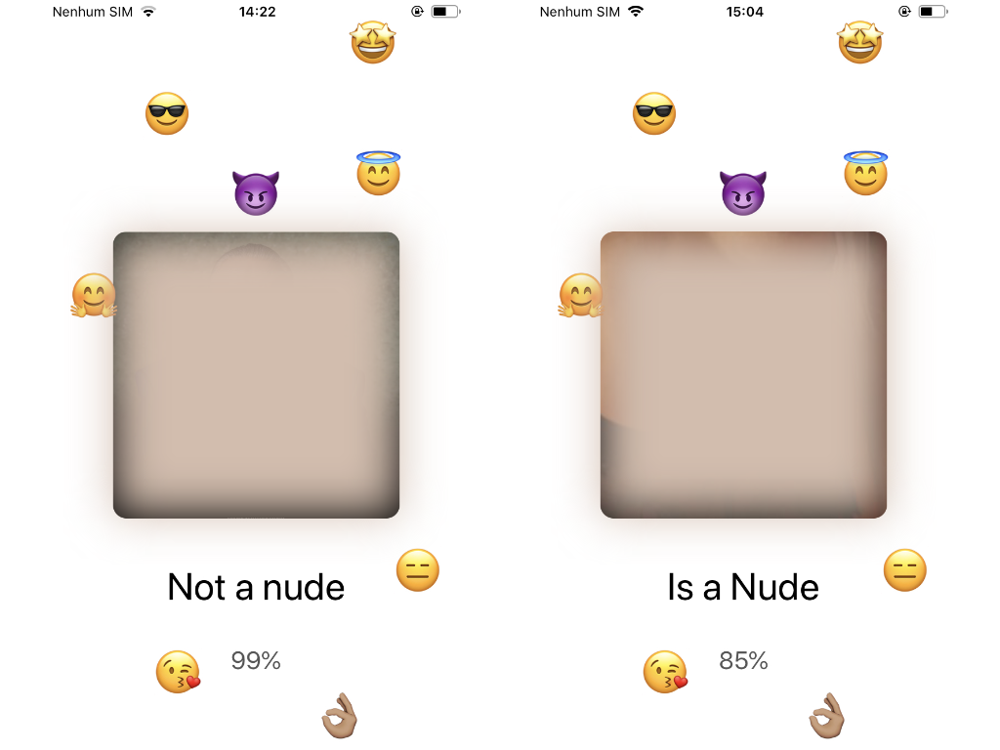

# Send me a nude or not
iOS sample project to demonstrate the use of CoreML Models.

The project uses [Nudity](https://github.com/yahoo/open_nsfw) CoreMl model to classify an image as NSFW (nude) or SFW (not nude), 
which can be used as a sensitive content filter ( ͡° ͜ʖ ͡°).

To classify an image, the app take a UIImage from camera or gallery of device and uses class NudityBase, an wrapper of Nudity.mlmodel.
NudityBase predict function get an UIImage with parameter and returns your classification, 'NSFW' or 'SFW'.

The UIImage is first resized and then converted to a CVPixelBuffer object to can be used by CoreML predict functions.
```
guard let imageResized = imageWithImage(image: image, scaledToSize: CGSize(width: 224, height: 224)),
      let pixelBuffer = toCVPixelBuffer(image: imageResized) else { return nil }
```
Then, the CVPixelBuffer object is used by Nudity CoreML model to classify the image.
```
let nudity = Nudity()
let output = try nudity.prediction(data: pixelBuffer)
return (output.classLabel, output.prob[output.classLabel] ?? 50)
```

The result can be used by your app to handle images, filtering NSFW or SFW contents, in this case, classes and probabilities are shown at screen.


## License

The project does not need a license :)
